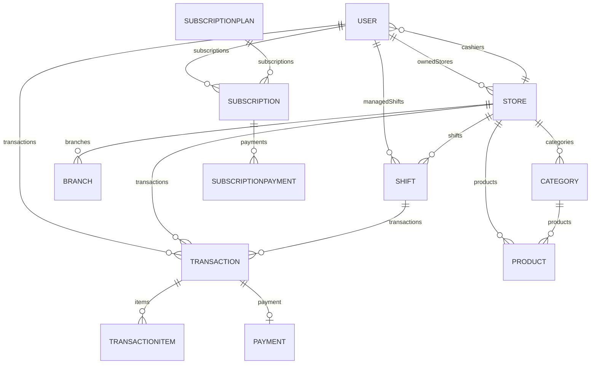

# KasirMu - Enterprise Multi-Tenant SmartPOS & SaaS Realtime Platform 🚀

[](https://nextjs.org/)
[](https://expressjs.com/)
[](https://www.prisma.io/)
[](https://tailwindcss.com/)
[](https://socket.io/)
[](https://midtrans.com/)

**KasirMu** adalah platform Kasir / Point of Sale (POS) modern tingkat enterprise berbasis cloud (SaaS) yang dirancang untuk mendukung operasional bisnis UMKM, Cafe/Restoran, Retail, Minimarket, hingga Bisnis Jasa (Laundry). Platform ini mengusung arsitektur **Multi-Tenant / Multi-Role**, sinkronisasi **WebSockets Realtime**, sistem **Kasir Pairing via Kode QR / PIN**, manajemen **Shift Laci Kasir**, serta integrasi pembayaran **Dynamic QRIS via Midtrans** yang dilengkapi simulator pengujian lokal bawaan.

---

## 📋 Daftar Isi

- [✨ Fitur Utama Berdasarkan Peran (Role-Based Features)](#-fitur-utama-berdasarkan-peran-role-based-features)
  - [1. 👑 Peran Super Admin (Platform Governance)](#1--peran-super-admin-platform-governance)
  - [2. 🏪 Peran Owner Toko (Merchant SaaS Management)](#2--peran-owner-toko-merchant-saas-management)
  - [3. 💻 Peran Kasir (POS Terminal & Cash Register)](#3--peran-kasir-pos-terminal--cash-register)
- [🛠️ Tech Stack & Arsitektur Sistem](#️-tech-stack--arsitektur-sistem)
- [🗄️ Skema Database & Entitas Utama (Prisma ORM)](#️-skema-database--entitas-utama-prisma-orm)
- [📂 Struktur Monorepo Proyek](#-struktur-monorepo-proyek)
- [🔌 Blueprints API Endpoints & Realtime WebSockets](#-blueprints-api-endpoints--realtime-websockets)
- [🚀 Panduan Instalasi & Setup Lokal](#-panduan-instalasi--setup-lokal)
- [🔐 Kredensial Akses Demo (Seeded Accounts)](#-kredensial-akses-demo-seeded-accounts)
- [💳 Integrasi Payment Gateway Midtrans & QRIS Simulator](#-integrasi-payment-gateway-midtrans--qris-simulator)
- [🖨️ Fitur Cetak Struk Thermal & PDF](#️-fitur-cetak-struk-thermal--pdf)
- [📄 Lisensi & Hak Cipta](#-lisensi--hak-cipta)

---

## ✨ Fitur Utama Berdasarkan Peran (Role-Based Features)

### 1. 👑 Peran Super Admin (Platform Governance)
* **Approval Owner & Toko**: Memverifikasi dan menyetujui akun merchant baru sebelum aktif di platform.
* **Manajemen Langganan Platform**: Mengelola paket langganan (Free, Basic, Pro, Lifetime), alokasi kuota merchant (maksimal toko, kasir, produk, kategori), serta *manual grant subscription*.
* **Platform Payment Gateway**: Mengonfigurasi kredensial Midtrans tingkat platform (terenkripsi AES-256) untuk pembayaran langganan SaaS oleh Owner.
* **Monitoring & Audit Log**: Meninjau seluruh jejak aktivitas pengguna (*Audit Log*) dan riwayat keamanan login (*Login Activity*) dari seluruh tenant.
* **Laporan Global & Maintenance**: Melihat metrik revenue platform, performa pendaftaran merchant, serta mengaktifkan mode *Maintenance Mode* sistem.

### 2. 🏪 Peran Owner Toko (Merchant SaaS Management)
* **Executive Realtime Analytics**: Grafik visual omzet harian/bulanan, total transaksi, rata-rata nilai keranjang (*AOV*), stok kritis, dan daftar produk terlaris berbasis Recharts.
* **Manajemen Produk & Kategori**: CRUD produk lengkap dengan harga jual, harga pokok (HPP), scanner barcode, peringatan stok minimum (*Min Stock Alert*), gambar produk, dan pengelompokan kategori.
* **Klaim Trial 14 Hari (Verifikasi NIK)**: Sistem klaim uji coba gratis terproteksi enkripsi hash NIK KTP untuk mencegah *abuse* klaim berulang.
* **Kasir Pairing & Keamanan PIN**: Fitur pembentukan Kode Pairing unik dan PIN Keluar (*Exit PIN*) untuk menghubungkan perangkat kasir tanpa membagikan kredensial akun Owner.
* **Pengaturan Pajak & Toko**: Konfigurasi Pajak (Inklusif / Eksklusif) per toko, alamat cabang, informasi struk, nomor WhatsApp, serta akun Midtrans toko pribadi.
* **Jadwal & Riwayat Shift**: Pembuatan jadwal kerja kasir (*Shift Schedule*) dan rekapitulasi laporan kas masuk/keluar setiap shift kasir.

### 3. 💻 Peran Kasir (POS Terminal & Cash Register)
* **Manajemen Shift Laci Kasir**: Alur Buka Shift (input modal awal kas) dan Tutup Shift (rekap total penjualan tunai, non-tunai, serta selisih kas).
* **Terminal Kasir Responsif & Cepat**: Antarmuka katalog produk pintar dengan filter kategori, pencarian kilat, serta integrasi **Barcode Scanner Hardware/Camera**.
* **Order Multi-Type**: Mendukung tipe pesanan *DINE_IN*, *TAKE_AWAY*, *DELIVERY*, dan *PICK_UP* dengan input nomor meja, nama pelanggan, dan catatan khusus.
* **Multi Payment Method**: Pembayaran Tunai (dengan hitung kembalian otomatis), QRIS Dynamic, dan E-Wallet.
* **QRIS Live Display & Auto-Settle Notification**: Layar QRIS interaktif dengan pembaruan status lunas otomatis via Socket.IO tanpa perlu *refresh* halaman.
* **Cetak Struk Thermal & PDF**: Dukungan cetak nota fisik format 58mm/80mm (ESC/POS compatible) dan unduhan berkas PDF.
* **Sistem Proteksi Modal Keluar (Exit PIN)**: Kasir harus memasukkan PIN keamanan toko untuk keluar dari mode terminal kasir.

---

## 🛠️ Tech Stack & Arsitektur Sistem

Proyek KasirMu dibangun menggunakan teknologi modern berbasis TypeScript di seluruh layer (Fullstack TS):

| Komponen | Teknologi | Keterangan / Library Utama |
| :--- | :--- | :--- |
| **Frontend Framework** | **Next.js 15 (App Router)** | React 19, TypeScript, Server & Client Components |
| **Frontend Styling** | **TailwindCSS v4** | UI modern responsif, CSS Variables, Glassmorphism |
| **State Management** | **Zustand** | Manajemen state lokal untuk Keranjang Kasir & Auth Store |
| **Realtime Engine** | **Socket.io-client** | Notifikasi transaksi & sinkronisasi status kasir realtime |
| **Visualisasi Data** | **Recharts & Lucide Icons** | Grafik omzet & set ikonik UI modern |
| **Backend Engine** | **Express.js (Node.js)** | RESTful API Server ditulis dengan TypeScript murni |
| **Database & ORM** | **Prisma ORM (SQLite / Postgres)** | Type-safe query builder, migrasi skema, dan seeding data |
| **Authentication** | **JWT & Cookie Parser** | Access token, Refresh Token, dan enkripsi password bcrypt |
| **Payment Gateway** | **Midtrans Node.js SDK** | API `/v2/charge` & Snap Token untuk QRIS & Subscription |
| **Security & Utilities** | **Crypto & Rate Limiter** | AES-256 encryption untuk server key, express-rate-limit |

---

## 🗄️ Skema Database & Entitas Utama (Prisma ORM)

Database KasirMu memiliki skema relasional dengan 24+ model utama:



### Model Utama Dalam `schema.prisma`:
1. `User`: Menyimpan akun Super Admin, Owner, dan Cashier beserta status profil, verifikasi Google OAuth, NIK, serta jejak sesi login.
2. `Store`: Data toko tenant, kode pairing QR, PIN pengaman kasir, logo, alamat, serta relasi ke cabang dan staf kasir.
3. `Branch`: Cabang-cabang lokasi toko di bawah naungan satu Store.
4. `Category` & `Product`: Pengelompokan dan item produk, stok, alert stok minim, HPP, harga jual, dan kode barcode.
5. `Transaction` & `TransactionItem`: Record transaksi kasir, nomor invoice, tipe order, rincian item, pajak, diskon, dan status pembayaran.
6. `Payment`: Detail transaksi gateway (QRIS string, Snap token, status settlement Midtrans, expiry time).
7. `Shift` & `ShiftSchedule`: Laporan shift kasir (jam mulai/selesai, kas awal, kas akhir, total omzet) dan penjadwalan kasir.
8. `SubscriptionPlan`, `Subscription`, `SubscriptionPayment`: Sistem SaaS berbayar dengan batas kuota toko/kasir/produk serta riwayat tagihan.
9. `TaxSetting`: Pengaturan tarif pajak toko dan tipe kalkulasi (Inclusive/Exclusive).
10. `PaymentGateway` & `PlatformPaymentGateway`: Penyimpanan kredensial API Midtrans terenkripsi untuk merchant & platform SaaS.
11. `TrialClaim`: Pencegahan klaim uji coba berulang menggunakan hashing NIK terisolasi.
12. `AuditLog` & `LoginActivity`: Log audit keamanan dan jejak IP/browser sesi login.

---

## 📂 Struktur Monorepo Proyek

```
KasirMu/
├── backend/                        # Express.js REST API & WebSocket Server
│   ├── prisma/
│   │   ├── schema.prisma           # Skema Lengkap Database Prisma
│   │   └── seed.ts                 # Script Seeding Account Demo & Master Data
│   ├── src/
│   │   ├── controllers/            # Logic Handler (Auth, Store, POS, Payment, Admin)
│   │   ├── middleware/             # Auth Guard, Role Check, Error Handler
│   │   ├── routes/                 # Endpoint Routers (REST API)
│   │   ├── services/               # Midtrans, Socket.IO, Crypto, Tax Service
│   │   ├── utils/                  # Helper JWT, Hash, Logger, Custom Errors
│   │   └── app.ts                  # Entry Point Server & Socket.IO Listener
│   ├── package.json
│   └── tsconfig.json
│
├── frontend/                       # Next.js 15 App Router Dashboard & POS
│   ├── src/
│   │   ├── app/
│   │   │   ├── (auth)/             # Halaman Login, Register, Forget Password
│   │   │   ├── (dashboard)/        # Panel Owner (Analytics, Products, Cashiers, Pairing, Settings)
│   │   │   ├── (cashier)/          # Terminal POS Kasir (POS Workspace, Shift, History)
│   │   │   ├── (superadmin)/       # Portal Super Admin (Approvals, Stores, Subscriptions, Logs)
│   │   │   ├── globals.css         # Styling Global TailwindCSS v4
│   │   │   └── layout.tsx          # Root Layout & Provider Context
│   │   ├── components/             # Reusable UI Primitives (Button, Modal, Card, Table)
│   │   ├── hooks/                  # Custom React Hooks (useSocket, useThermalPrinter)
│   │   ├── store/                  # Zustand Global Stores (AuthStore, CartStore)
│   │   └── types/                  # Definition Interface TypeScript
│   ├── package.json
│   └── tailwind.config.js
│
└── README.md                       # Dokumentasi Utama Proyek KasirMu
```

---

## 🔌 Blueprints API Endpoints & Realtime WebSockets

### REST API Endpoints Overview (`/api`)

| Prefix Route | Method | Target & Deskripsi | Otorisasi Role |
| :--- | :--- | :--- | :--- |
| `/api/auth` | `POST` | `/login`, `/register`, `/logout`, `/me`, `/claim-trial` | Public / All |
| `/api/store` | `GET/POST/PUT` | Kelola profil toko, cabang, pairing code, dan PIN kasir | `OWNER` |
| `/api/products` | `GET/POST/PUT/DELETE` | CRUD produk, gambar, barcode scanner lookup, update stok | `OWNER`, `CASHIER` |
| `/api/cashiers` | `GET/POST/PUT/DELETE` | Manajemen staf kasir, pembuatan PIN, reset akses | `OWNER` |
| `/api/transactions`| `GET/POST` | Pembuatan transaksi kasir, riwayat invoice, filter tanggal | `OWNER`, `CASHIER` |
| `/api/payment` | `POST/GET` | Trigger Midtrans QRIS Charge `/charge-qris`, webhook callback | `CASHIER`, Public Callback |
| `/api/analytics` | `GET` | Ringkasan statistik omzet, produk terlaris, grafik penjualan | `OWNER` |
| `/api/tax` | `GET/PUT` | Konfigurasi tarif pajak toko (Inklusif/Eksklusif) | `OWNER` |
| `/api/subscriptions`| `GET/POST` | Daftar paket SaaS, checkout langganan Midtrans, manual grant | `OWNER`, `SUPER_ADMIN` |
| `/api/superadmin` | `GET/POST/PUT` | Approval merchant, platform settings, maintenance, audit logs | `SUPER_ADMIN` |

### Channel WebSockets Realtime (Socket.IO)

* 🔔 `transaction:new`: Disebarkan saat kasir membuat transaksi baru.
* 💳 `transaction:paid`: Notifikasi instan saat pembayaran QRIS dikonfirmasi lunas oleh Midtrans / Simulator.
* ⏱️ `shift:update`: Pembaruan status shift laci kasir secara realtime.
* 🟢 `cashier:status`: Indikator status online/offline kasir pada dashboard owner.

---

## 🚀 Panduan Instalasi & Setup Lokal

### Prasyarat System
- **Node.js**: v20.x atau v24.x (Direkomendasikan LTS)
- **NPM**: v10.x+
- **Database**: SQLite (Bawaan Dev) atau PostgreSQL

---

### Langkah 1: Clone Repository & Setup Backend

1. Buka terminal dan masuk ke folder `backend`:
   ```bash
   cd backend
   ```
2. Salin file contoh lingkungan `.env.example` ke `.env`:
   ```bash
   cp .env.example .env
   ```
3. Sesuaikan isi file `.env`:
   ```env
   PORT=5000
   NODE_ENV=development
   DATABASE_URL="file:./dev.db" # Atau URI PostgreSQL Anda
   JWT_SECRET="rahasia_super_kunci_jwt_kasirmu_2026"
   CLIENT_URL="http://localhost:3000"

   # Midtrans Store Integration (Kosongkan/Isi Token Sandbox)
   MIDTRANS_SERVER_KEY="SB-Mid-server-placeholderkey"
   MIDTRANS_CLIENT_KEY="SB-Mid-client-placeholderkey"
   MIDTRANS_IS_PRODUCTION=false
   ```
4. Instal dependencies backend:
   ```bash
   npm install
   ```
5. Jalankan migrasi database Prisma:
   ```bash
   npx prisma db push
   ```
6. Jalankan script seeding untuk mengisi akun demo default:
   ```bash
   npm run seed
   ```
7. Jalankan backend server:
   ```bash
   npm run dev
   ```
   *Server Backend akan berjalan di `http://localhost:5000`*

---

### Langkah 2: Setup Frontend Next.js

1. Buka terminal baru dan masuk ke folder `frontend`:
   ```bash
   cd ../frontend
   ```
2. Buat file `.env.local`:
   ```env
   NEXT_PUBLIC_API_URL="http://localhost:5000/api"
   NEXT_PUBLIC_SOCKET_URL="http://localhost:5000"
   ```
3. Instal dependencies frontend:
   ```bash
   npm install
   ```
4. Jalankan dev server Next.js:
   ```bash
   npm run dev
   ```
   *Aplikasi Frontend akan berjalan di `http://localhost:3000`*

---

## 🔐 Kredensial Akses Demo (Seeded Accounts)

Setelah Anda menjalankan `npm run seed` di backend, Anda dapat langsung mencoba login di `http://localhost:3000/login` dengan akun berikut:

| Peran (Role) | Email Login | Password | Hak Akses Utama |
| :--- | :--- | :--- | :--- |
| **👑 Super Admin** | `superadmin@kasirmu.com` | `admin123` | Portal Super Admin (`/superadmin`), Approval Toko, Global Logs & SaaS Subscriptions |
| **🏪 Owner Toko** | `owner@kasirmu.com` | `owner123` | Dashboard Owner (`/dashboard`), Kelola Produk, Analytics Omzet, Pairing Kode QR |
| **💻 Kasir POS** | `cashier@kasirmu.com` | `cashier123` | Terminal POS Kasir (`/pos`), Transaksi Kasir, Buka/Tutup Shift (PIN: `1234`) |

---

## 💳 Integrasi Payment Gateway Midtrans & QRIS Simulator

KasirMu dilengkapi dengan dua mode penanganan pembayaran QRIS:

```
[POS Kasir Checkout] ──► [Backend /charge-qris]
                              │
             ┌────────────────┴────────────────┐
             ▼                                 ▼
   [Live Midtrans API Key]         [Placeholder Key Detect]
   Mengirim request ke             Memicu SIMULATOR LOKAL
   api.sandbox.midtrans.com        Backend Generate QR Dummy
             │                                 │
             └────────────────┬────────────────┘
                              ▼
                [Tampilan QR Code di Kasir]
                              │
             ┌────────────────┴────────────────┐
             ▼                                 ▼
  [Pembayaran App Bank/E-Wallet]   [Klik Tombol Simulator "Settle"]
  Midtrans Webhook Callback        Callback Lokal Dipicu Backend
             │                                 │
             └────────────────┬────────────────┘
                              ▼
            [Socket.IO Pancarkan Event "PAID"]
             ▶ Struk Otomatis Terbuka & Lunas!
```

1. **Mode Production / Sandbox Midtrans**: Memanggil API Midtrans asli jika `MIDTRANS_SERVER_KEY` diisi dengan token resmi.
2. **Mode Simulator Lokal**: Jika token diatur sebagai `SB-Mid-server-placeholderkey`, sistem secara cerdas akan mengaktifkan *Built-in Local Simulator*. Kasir atau Owner dapat menekan tombol **"Simulasikan Callback Selesai (Settle)"** pada modal transaksi untuk menguji alur lunas realtime tanpa memerlukan kunci API Midtrans asli.

---

## 🖨️ Fitur Cetak Struk Thermal & PDF

Terminal Kasir POS KasirMu mendukung dua opsi pencetakan nota transaksi:
* **Thermal Receipt Printing (58mm / 80mm)**: Menggunakan stylesheet khusus `@media print` yang mengoptimalkan layout struk untuk printer kasir thermal Bluetooth / USB (ESC/POS compatible).
* **Unduh PDF Invoice**: Membuat salinan file PDF digital yang dapat dikirimkan ke WhatsApp pelanggan atau disimpan untuk arsip keuangan.

---

## 📄 Lisensi & Hak Cipta

Didevelop oleh **KasirMu Team / notcrazy29**.  
Seluruh hak cipta dilindungi undang-undang. Proyek ini siap dikembangkan dan disesuaikan untuk kebutuhan SaaS POS UMKM Indonesia.
